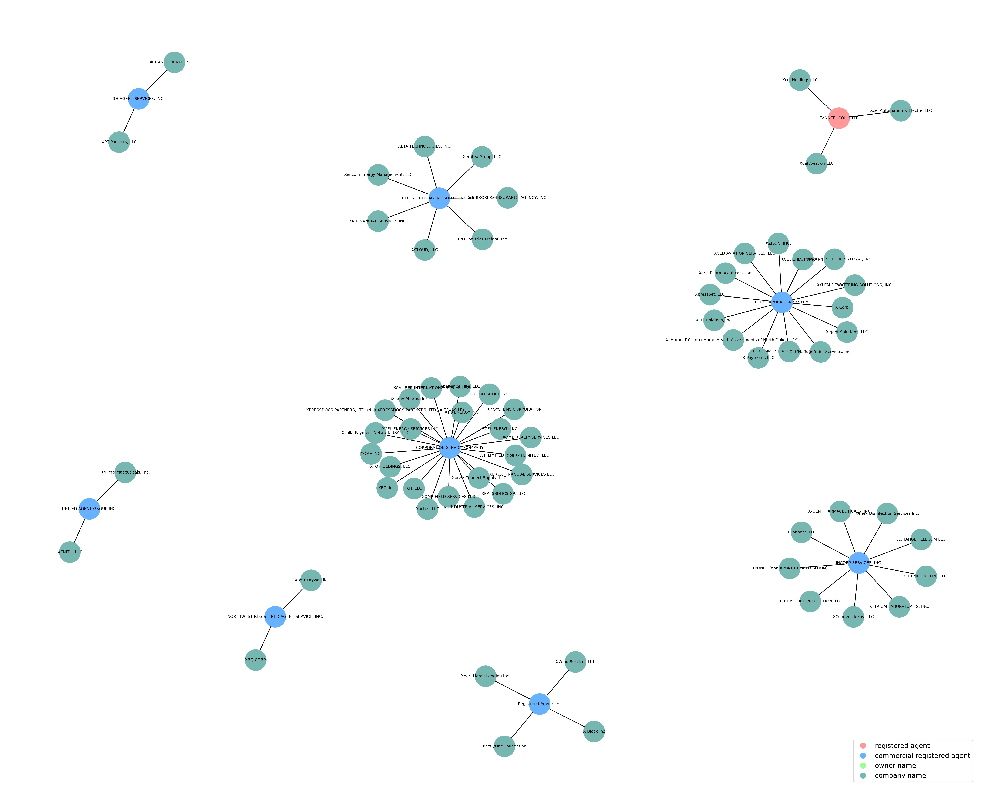

# North Dakota Business Data Crawling and Visualization

## Overview

This project is a web scraping tool that extracts business data from the North Dakota FirstStop SOS website, processes the data, and generates a graph to visualize relationships between companies and their primary agents. The scraping script is built using the `selenium`, while the data visualization is done using `networkx` and `matplotlib`.

## Features

- **Business Data Extraction**: Scrapes business information such as company name, filing date, status, and more from the North Dakota FirstStop SOS website.
- **Detailed Data Retrieval**: Fetches additional filing details for each business.
- **Data Processing**: Creates a CSV file for the collected data and processes company-agent relationships.
- **Network Graph Visualization**: Uses `NetworkX` to generate a graph to illustrate connections between companies and their agents.

## Prerequisites

- Python 3.6+
- Libraries: `selenium`, `requests`, `networkx`, `matplotlib`, `pandas`, `numpy`, `pygraphviz`

## Visualization / Result

